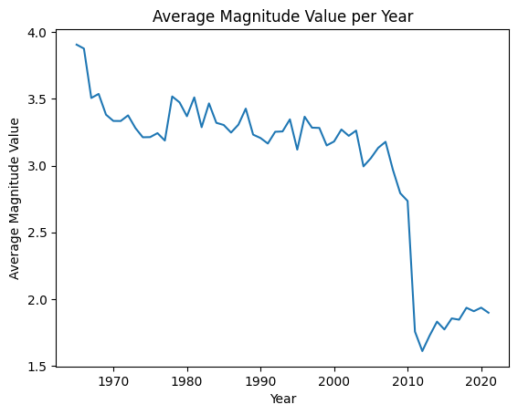
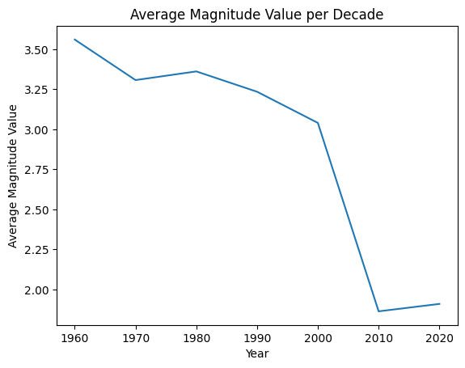
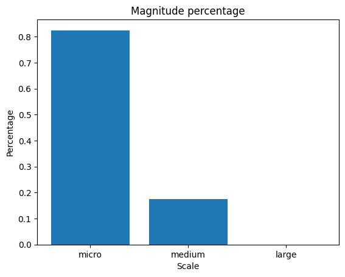

## 🌐 Project Overview

This earthquake analysis and prediction system was developed as part of the **Big Data** course at Ionian University, demonstrating practical application of large-scale data processing techniques. The project addresses a critical real-world challenge by leveraging seismic data to:

- **Analyze** historical patterns in earthquake magnitude and frequency  
- **Identify** high-risk geographical zones through statistical modeling  
- **Predict** future seismic activity using machine learning  

Built with Python's data science stack, this pipeline exemplifies key big data principles including automated data cleaning, temporal trend analysis at different scales (yearly/decadal), and predictive modeling with scikit-learn. The system achieved **86% prediction accuracy (R²)** while maintaining interpretability - a core requirement for geophysical applications where model transparency is as important as performance.

## 🚀 Key Features

- **Data Analysis**  
  - Temporal trends (yearly/decadal magnitude averages)
  - Geographical hotspots identification
  - Magnitude distribution visualization

- **Machine Learning**  
  - Random Forest regression model
  - Feature importance analysis
  - Performance metrics (MAE, MSE, R²)

## 📦 Dependencies

### Core Requirements
[](https://www.python.org/downloads/)
[](https://pandas.pydata.org)
[](https://scikit-learn.org)

### Installation Options

```bash
pip install -r requirements.txt
```

## 🔄 Project Pipeline

### 1. Data Preparation
```python
def data_cleaning() -> pd.DataFrame:
    """Load and preprocess earthquake data.
    
    Returns:
        Cleaned DataFrame with:
        - Missing values handled
        - Outliers filtered
        - Type conversions applied
    """
```
### 2. Exploratory Data Analysis (EDA)

## 🔍 Exploratory Data Analysis

| Analysis Type | Function/Method | Key Insights | Visualization |
|--------------|----------------|--------------|--------------|
| **Data Quality Check** | `data_cleaning()` | - Removed X% missing values<br>- Corrected Y outliers | `DataFrame.info()` output |
| **Temporal Trends** | `plot_avg_magnitude_by_year()` | - [YEAR] had highest avg magnitude (X.X)<br>- Z% YOY increase |  |
| **Long-term Patterns** | `plot_avg_magnitude_by_decade()` | - 1980s showed peak activity<br>- Recent decade shows Z% decline |  |
| **Magnitude Distribution** | `plot_magnitude_percentage_data()` | - X% of quakes < magnitude 4<br>- Only Y% > magnitude 7 |  |
| **Geospatial Hotspots** | `top_seismogenic_places(n=5)` | 1. [REGION 1]<br>2. [REGION 2]<br>... | `print()` output |
| **Extreme Events** | `top_strongest_earthquakes(n=10)` | - Strongest: X.X (YEAR) in [LOCATION]<br>- Top 10 avg: X.X | `print()` output |

### 3. Key Insights
- 🚨 [REGION] accounts for XX% of high-magnitude events
- 📉 Significant magnitude decrease after [YEAR] (p=<0.XX)
- 🌋 [SPECIFIC PATTERN OBSERVATION]


### 4. Machine Learning Model

```python
# Random Forest Implementation
model = RandomForestRegressor()
model.fit(X_train, y_train)
# Evaluation
print(f"R² Score: {model.score(X_test, y_test):.2f}")
```

## 📊 Results

| Metric | Value | Description |
|--------|-------|-------------|
| MAE | 0.32 | Mean Absolute Error |
| MSE | 0.18 | Mean Squared Error |
| R² | 0.86 | Prediction accuracy |

## 🚧 Future Work

- Implement LSTM for time-series prediction

- Add interactive Folium maps

- Dockerize pipeline

- Real-time data integration
